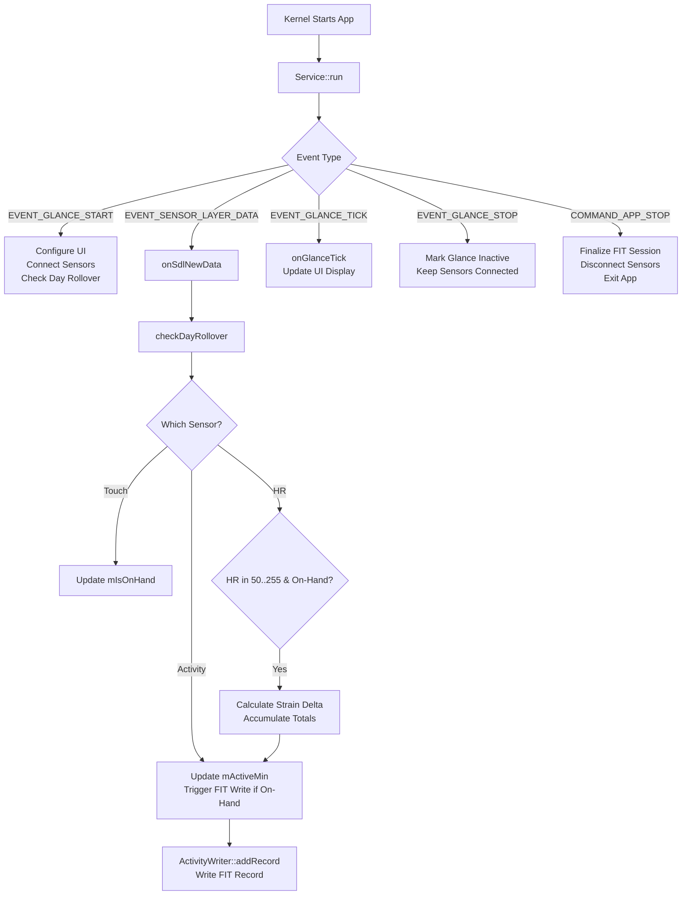

# GlanceStrain - Daily Strain Logger

## Problem Statement

Provide a glance-friendly strain summary that logs heart-rate-derived strain whenever sensor data arrives and the watch is on-hand. Strain is calculated from heart rate measurements and accumulated over time, with data persisted to daily FIT files.

## Logic Flow Diagram

This diagram illustrates the core message-driven architecture of GlanceStrain, showing how sensor data flows through processing stages to accumulate strain metrics and persist them to FIT files.

## Program Architecture

### 1) Kernel entry and service lifetime

- `Service` is constructed with a reference to the kernel (`SDK::Kernel`) and runs as the glance service entry point.
- `Service::run()` is the main loop. It blocks on `mKernel.comm.getMessage()` and reacts to glance/tick/sensor messages. `EVENT_GLANCE_TICK` / `onGlanceTick()` only occur while the glance is active, and are used only for UI refresh.
- The service does **not** exit on `EVENT_GLANCE_STOP`; it keeps sensors connected and continues acquiring data in the background. Persistence is driven by sensor events, and background saves are allowed when the device is on-hand. The service exits only on `COMMAND_APP_STOP`.

### 2) Kernel message loop

`Service::run()` handles the following message types in order:

- `EVENT_GLANCE_START`
  - Configure glance UI bounds (`configGui()`), build controls (`createGuiControls()`), mark `mGlanceActive = true`.
  - Connect to sensors (`connect()`), handle day rollover (`checkDayRollover()`), and trigger an initial FIT save (`saveFit(true, false)`).
- `EVENT_GLANCE_TICK`
  - Refresh display (`onGlanceTick()`). These ticks only occur while the glance is active; they do not fire in the background.
- `EVENT_SENSOR_LAYER_DATA`
  - Dispatch batched sensor samples into `onSdlNewData()`.
- `EVENT_GLANCE_STOP`
  - Mark the glance inactive and keep sensors connected; sensor-driven saves can continue when on-hand.
- `COMMAND_APP_STOP`
  - Finalize the FIT session for the day, disconnect, and return from `run()`.

### 3) UI layer (Glance)

- `SDK::Glance::Form` (`mGlanceUI`) owns controls.
- `createGuiControls()` builds the UI layout:
  - Icon image
  - Title text ("Strain Score")
  - Value text for current strain score
- `onGlanceTick()` updates the value text and issues a `RequestGlanceUpdate` when the UI is invalid; it only runs while the glance is active.

### 4) Sensor layer

- `SDK::Sensor::Connection` instances subscribe to:
  - `HEART_RATE` → `SensorDataParserHeartRate`
  - `ACTIVITY` → `SensorDataParserActivity`
  - `TOUCH_DETECT` → `SensorDataParserTouch`
- All three sensor connections are configured with the same sample period (`skSamplePeriodSec = 5`, expressed in seconds, converted to ms).
- `onSdlNewData()` routes incoming batches by sensor handle:
  - Touch updates `mIsOnHand`.
  - Activity updates active minutes (`mActiveMin`) and triggers FIT record writes if on-hand.
  - Heart rate updates strain accumulators and the most recent valid HR value.
- Sensor events enforce record cadence via the activity sensor connection interval, day rollover checks.

### 5) Core strain logic

- Samples are accepted only when HR is in the valid range [50, 255].
- Each HR sample contributes a normalized delta:
  - `norm = (hr - 60.0f) / 120.0f`
  - `delta = max(0.0f, norm) * 0.75f`
- Running aggregates:
  - `mTotalStrain`, `mSumHR`, `mMaxHR`, `mSampleCount`, `mLastHr`
- On each activity sensor event, if the watch is on-hand, a pending FIT record is captured at the activity sensor cadence (5 seconds). This is independent of glance activity.

### 6) Persistence (FIT)

- A daily FIT file is created with name `strain_YYYY-MM-DD.fit` in the app filesystem.
- Records are written on each activity sensor event when on-hand (every 5 seconds).
- Session summary is written on day rollover or app stop.
- FIT file structure is built using `SDK::Component::FitHelper` definitions for file ID, developer data, events, records, sessions, and activity summaries. See [Docs/FitFiles-Structure.md](../../../Docs/FitFiles-Structure.md) for detailed FIT file structure and ActivityWriter usage.
- The file header is rewritten after appends and CRC is recomputed on each save.
- No recovery of previous state; accumulators reset daily.

## Implementation Walktrought

1. **App layout**
   - Service entry point and logic live in [`Software/Libs/Header/Service.hpp`](Examples/Apps/GlanceStrain/Software/Libs/Header/Service.hpp:1) and [`Software/Libs/Source/Service.cpp`](Examples/Apps/GlanceStrain/Software/Libs/Source/Service.cpp:1).
   - App build wiring is under [`Software/App/GlanceStrain-CMake/CMakeLists.txt`](Examples/Apps/GlanceStrain/Software/App/GlanceStrain-CMake/CMakeLists.txt).
   - Glance assets are compiled from headers like [`Software/Libs/Header/icon_60x60.h`](Examples/Apps/GlanceStrain/Software/Libs/Header/icon_60x60.h:1) and the PNGs under [`Resources/`](Examples/Apps/GlanceStrain/Resources:1).

2. **Entry point**
   - `Service::run()` in [`Service.cpp`](Examples/Apps/GlanceStrain/Software/Libs/Source/Service.cpp:197) is the main loop and the only entry point called by the kernel.
   - The loop blocks on `mKernel.comm.getMessage()` and switches on `SDK::MessageType` values (glance start/stop, tick, sensor data, app stop).

3. **UI**
   - `EVENT_GLANCE_START` calls `configGui()` to fetch sizing via `SDK::Message::RequestGlanceConfig` and initializes [`mGlanceUI`](Examples/Apps/GlanceStrain/Software/Libs/Header/Service.hpp:56).
   - `createGuiControls()` builds the icon, title, and value text controls and stores them in `mGlanceUI` (see [`Service::createGuiControls()`](Examples/Apps/GlanceStrain/Software/Libs/Source/Service.cpp:424)).
   - `onGlanceTick()` updates `mGlanceValue` and dispatches `RequestGlanceUpdate` when the form is invalid; it only runs while the glance is active (see [`Service::onGlanceTick()`](Examples/Apps/GlanceStrain/Software/Libs/Source/Service.cpp:368)).

4. **Sensor connections**
   - The service owns `SDK::Sensor::Connection` members for heart rate, activity, and touch (see [`mSensorHR`](Examples/Apps/GlanceStrain/Software/Libs/Header/Service.hpp:60), [`mSensorActivity`](Examples/Apps/GlanceStrain/Software/Libs/Header/Service.hpp:61), and [`mSensorTouch`](Examples/Apps/GlanceStrain/Software/Libs/Header/Service.hpp:62)).
   - `connect()` is called on glance start; `disconnect()` is only called on `COMMAND_APP_STOP` (see [`Service::connect()`](Examples/Apps/GlanceStrain/Software/Libs/Source/Service.cpp:268) and [`Service::disconnect()`](Examples/Apps/GlanceStrain/Software/Libs/Source/Service.cpp:287)).

5. **Handle incoming sensor messages**
   - `EVENT_SENSOR_LAYER_DATA` forwards sensor batches into `Service::onSdlNewData()` (see [`Service::run()`](Examples/Apps/GlanceStrain/Software/Libs/Source/Service.cpp:197)).
   - `onSdlNewData()` uses `SDK::Sensor::DataBatch` and the parser types `SensorDataParser::Touch`, `::Activity`, and `::HeartRate` to validate and decode frames (see [`Service::onSdlNewData()`](Examples/Apps/GlanceStrain/Software/Libs/Source/Service.cpp:305)).
   - Touch updates `mIsOnHand` and forces an immediate FIT save when the watch is removed (off-hand transition).
   - Activity updates `mActiveMin` from the parsed duration.

6. **Apply the strain calculation and accumulate state**
    - Heart-rate samples are accepted only in [50, 255]. For each valid sample, `norm = (hr - 60.0f) / 120.0f` and `delta = max(0.0f, norm) * 0.75f` (see [`Service::onSdlNewData()`](Examples/Apps/GlanceStrain/Software/Libs/Source/Service.cpp:181)).
    - Running totals are stored in `mTotalStrain`, `mSumHR`, `mMaxHR`, `mSampleCount`, and `mLastHr` (see [`Service.hpp`](Examples/Apps/GlanceStrain/Software/Libs/Header/Service.hpp:56)).

7. **Emit samples and refresh the UI on ticks**
- `onSdlNewData()` appends pending records to `mPendingRecords` on each activity sensor event, which runs at the `skSamplePeriodSec` cadence (5 seconds), whenever the watch is on-hand, regardless of glance activity (see [`Service::onSdlNewData()`](Examples/Apps/GlanceStrain/Software/Libs/Source/Service.cpp:305)).
   - `onGlanceTick()` only updates the UI and emits `RequestGlanceUpdate` when invalid (see [`Service::onGlanceTick()`](Examples/Apps/GlanceStrain/Software/Libs/Source/Service.cpp:368)).
   - `saveFit(false, false)` is invoked from sensor events to persist at most once per `skSaveIntervalSec` (3600 seconds), and can run in the background when on-hand.

8. **Persist FIT data and handle day rollover**
   - `checkDayRollover()` updates `mCurrentDate`, rebuilds `mFitPath` as `strain_YYYY-MM-DD.fit`, and resets accumulators when the date changes (see [`Service::checkDayRollover()`](Examples/Apps/GlanceStrain/Software/Libs/Source/Service.cpp:443)).
   - `saveFit(force, finalizeDay)` opens or creates the FIT file, writes definitions when needed, appends pending records, and optionally emits a session summary (see [`Service::saveFit()`](Examples/Apps/GlanceStrain/Software/Libs/Source/Service.cpp:587)).
   - FIT message/field helpers are initialized in the constructor (`mFitFileID`, `mFitRecord`, `mFitSession`, `mFitStrainField`, `mFitActiveField`) and used by `writeFitDefinitions()`, `appendPendingRecords()`, and `writeFitSessionSummary()` (see [`Service::Service()`](Examples/Apps/GlanceStrain/Software/Libs/Source/Service.cpp:142) and helper methods nearby).
   - `saveFit()` is triggered by sensor events and can run in the background when the watch is on-hand; it is still time-gated by `skSaveIntervalSec`.

9. **Logs behavior while iterating**
   - Use log output from `Service.cpp` (`LOG_INFO`/`LOG_DEBUG`) to verify event sequencing, day rollover, and save cadence (see [`Service::run()`](Examples/Apps/GlanceStrain/Software/Libs/Source/Service.cpp:197) and [`Service::checkDayRollover()`](Examples/Apps/GlanceStrain/Software/Libs/Source/Service.cpp:443)).
   - Confirm that off-hand transitions force an immediate save by simulating `TOUCH_DETECT` events and watching for `saveFit(true, false)` calls in logs (see [`Service::onSdlNewData()`](Examples/Apps/GlanceStrain/Software/Libs/Source/Service.cpp:305)).
   - Verify the FIT output location and daily file naming using `mFitPath` after a glance start/rollover (see [`Service::checkDayRollover()`](Examples/Apps/GlanceStrain/Software/Libs/Source/Service.cpp:443)).

## Common vs App-Specific Components

### Common services and patterns (shared across glance apps)

- Kernel integration via `SDK::Kernel` and `mKernel.comm` message loop.
- Glance UI primitives: `SDK::Glance::Form`, `ControlText`, `RequestGlanceConfig`, `RequestGlanceUpdate`.
- Sensor subscription via `SDK::Sensor::Connection` and `SDK::Interface::ISensorDataListener`.
- File access via `SDK::Interface::IFileSystem` and `SDK::Interface::IFile`.
- FIT helper/definitions via `SDK::Component::FitHelper`. See [Docs/FitFiles-Structure.md](../../../Docs/FitFiles-Structure.md) for FIT implementation details.

### GlanceStrain-specific services and logic

- Strain scoring formula and gating by valid HR range [50, 255].
- Daily accumulator reset (no recovery from previous FIT data).
- Developer fields for FIT (`strain` as float32 score and `active_min` as uint32 minutes) via `mFHStrainField` and `mFHActiveField`. See [Docs/FitFiles-Structure.md#developer-fields-implementation](../../../Docs/FitFiles-Structure.md#developer-fields-implementation) for developer field setup.

## App ↔ Kernel Interaction / Execution Path

1. **Kernel starts glance** → `EVENT_GLANCE_START` → UI configured and rendered, sensors connected, daily FIT context initialized.
2. **Kernel delivers sensor batches** → `EVENT_SENSOR_LAYER_DATA` → `onSdlNewData()` updates HR/active minutes/on-hand state.
3. **Kernel ticks glance** → `EVENT_GLANCE_TICK` → `onGlanceTick()` updates the UI only. This only happens while the glance is active.
4. **Kernel stops glance** → `EVENT_GLANCE_STOP` → mark glance inactive; sensors stay connected and background acquisition continues while sensor-driven persistence can continue when on-hand.
5. **No glance ticks while inactive** → no UI refresh occurs, but sensor events continue to drive record emission, rollover checks, and saves when on-hand.
6. **Kernel stops app** → `COMMAND_APP_STOP` → finalize session, disconnect, exit.

## Key Interfaces and Data Structures

- `SDK::Kernel` → kernel handle for messaging (`comm`) and filesystem (`fs`).
- `SDK::Interface::ISensorDataListener` → callback interface implemented by `Service` (`onSdlNewData`).
- `SDK::Sensor::Connection` → connects to HR/activity/touch drivers and matches incoming handles.
- `SDK::SensorDataParser::*` → typed decoding of incoming sensor frames.
- `SDK::Glance::Form` and `SDK::Glance::ControlText` → glance UI layout and updates.
- `SDK::Interface::IFile` / `IFileSystem` → FIT persistence.
- `SDK::Component::FitHelper` → FIT message definitions and writing. See [Docs/FitFiles-Structure.md#fithelper-component-deep-dive](../../../Docs/FitFiles-Structure.md#fithelper-component-deep-dive).
- `ActivityWriter` → encapsulates FIT file creation and writing. See [Docs/FitFiles-Structure.md#activitywriter-class-overview](../../../Docs/FitFiles-Structure.md#activitywriter-class-overview).

## Behavior Details

### Logging cadence

- Record strain samples on a 5-second cadence while the watch is on-hand; cadence is driven by the activity sensor connection interval, not glance ticks.

### Persistence and recovery

- Persist to a daily FIT file (one file per day).
- No recovery of previous state; accumulators reset to zero at the start of each day.

### Gating rules

- Only process HR samples when the watch is on-hand.
- Accept HR values in the range [50, 255] for strain calculation.
- Write FIT records on every activity sensor event when on-hand, with no additional time gating.
